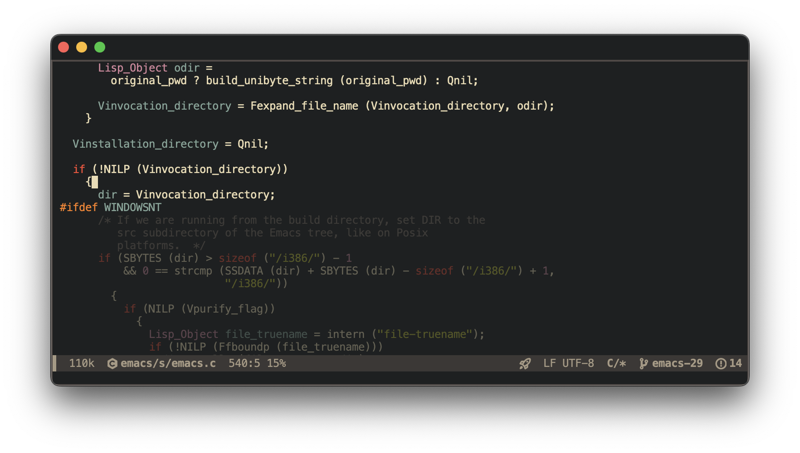
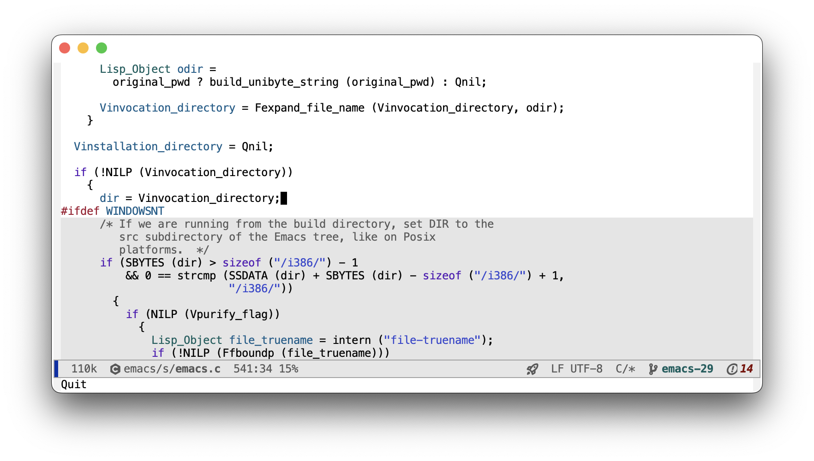

# clangd-inactive-regions.el

## About

Eglot extension to support the new clangd inactiveRegions LSP
capability introduced in clangd-17.

Highlights inactive code in a LSP aware way, taking into account
compile time includes and defines for current project.

Listens to inactiveRegions notifications and shades them with one of
the available-methods:

* `darken-foreground` makes inactive code semitransparent blending
  current foreground and background colors
* `shade-background` makes inactive code background slightly darker or
  lighter depending on current theme
* `shadow` applies the shadow face to inactive code

## Screenshots

#### `darken-foreground` method, gruvbox dark theme, 30% opacity

Inactive regions are provided by the language server so they will
honor your include paths and compile time defines. Here I'm looking at
my `emacs-29` branch configured to build on MacOS and you can see
Windows code is correctly disabled.



#### `shade-background` method, modus operandi theme, 10% shading



## Installation

You will need at least emacs 29.1 and clangd-17.

At the moment the package is little more than an experiment. If you
want to try it just copy the .el file somewhere in the load path.

Feedback, issues and pull requests more than welcome!

## Usage

```lisp
(use-package clangd-inactive-regions
  :ensure nil
  :init
  (setq clangd-inactive-regions-method "darken-foreground")
  (setq clangd-inactive-regions-opacity 0.55)
  (add-hook 'eglot-managed-mode-hook #'clangd-inactive-regions-mode))
```


## Caveats

As far as I know Emacs doesn't have a way to set foreground text
opacity. Best would be a face attribute so that you can set it in an
overlay covering each whole region and be done with it. Unfortunately
there is no attribute for this yet.

Hence `darken-foreground` method is a fragile and inefficient hack around
fontification: for each inactive region it looks for symbols with
different faces and applies to each of them a different overlay with a
dimmed foreground color.

It seems to work with cc and c-ts modes (albeit a little slower than
I'd like) but could totally break other modes or features I'm not aware of.

If you know a better way please do let me know.
